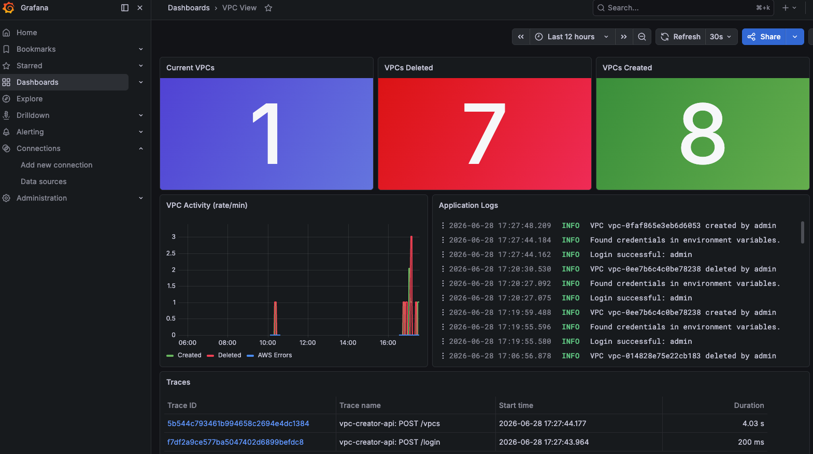

# VPC Creator API

A minimal Python API that creates AWS VPCs using FastAPI, JWT authentication, and SQLite persistence. Costs **$0** to run.

- disclaimer: AI was used to write tests and to update README
---


## Grafana dashboard

This repository includes a provisioned Grafana dashboard that visualizes VPC creation metrics, request latencies, and traces. Run Grafana

Snapshot:



**Highlights:**
- Visualizes VPC creation and API metrics.
- Shows request latency and tracing spans for troubleshooting.
- Dashboard JSON is provisioned from [grafana/provisioning/dashboards/vpc-view.json](grafana/provisioning/dashboards/vpc-view.json).


## Project structure

```
main.py          # FastAPI app — auth, validation, endpoints, boto3 calls
database.py      # SQLite persistence (save_vpc / get_vpc / list_vpcs)
requirements.txt
Makefile
tests/
  test_main.py   # pytest + moto — no real AWS resources
```

---

## Installation

```bash
python -m venv .venv
source .venv/bin/activate

pip install -r requirements.txt

cp .env.example .env
# edit .env — set SECRET_KEY, ADMIN_USERNAME, ADMIN_PASSWORD
```

Generate a secret key:

```bash
openssl rand -hex 32
```

---

## AWS credential configuration

The app never stores AWS credentials. It relies on boto3's default provider chain.

**Option A — named profile (recommended)**

```bash
aws configure --profile vpc-creator
export AWS_PROFILE=vpc-creator
```

**Option B — environment variables**

```bash
export AWS_ACCESS_KEY_ID=...
export AWS_SECRET_ACCESS_KEY=...
export AWS_DEFAULT_REGION=us-east-1
```

---

## IAM policy

Create an IAM User (`vpc-creator-api`) with programmatic access only and attach this policy:

```json
{
  "Version": "2012-10-17",
  "Statement": [
    {
      "Sid": "VPCCreatorEC2",
      "Effect": "Allow",
      "Action": [
        "ec2:CreateVpc",
        "ec2:DeleteVpc",
        "ec2:ModifyVpcAttribute",
        "ec2:CreateSubnet",
        "ec2:DeleteSubnet",
        "ec2:CreateRouteTable",
        "ec2:DeleteRouteTable",
        "ec2:AssociateRouteTable",
        "ec2:DisassociateRouteTable",
        "ec2:CreateRoute",
        "ec2:CreateInternetGateway",
        "ec2:DeleteInternetGateway",
        "ec2:AttachInternetGateway",
        "ec2:DetachInternetGateway",
        "ec2:CreateTags",
        "ec2:DescribeVpcs",
        "ec2:DescribeSubnets",
        "ec2:DescribeRouteTables",
        "ec2:DescribeInternetGateways",
        "ec2:DescribeAvailabilityZones"
      ],
      "Resource": "*"
    }
  ]
}
```

> Most EC2 Create/Describe actions require `"Resource": "*"` — AWS does not support resource-level ARN restrictions for them. Least-privilege is achieved by limiting the allowed actions, not the resource scope.

**Steps:**
1. IAM → Policies → Create policy → paste JSON above → name `VPCCreatorPolicy`
2. IAM → Users → Create user → `vpc-creator-api`, no console access
3. Attach `VPCCreatorPolicy` to the user
4. Security credentials → Create access key → "Application running outside AWS"
5. `aws configure --profile vpc-creator`

---

## Running the API

```bash
export AWS_PROFILE=vpc-creator
make run
# http://localhost:8000
# http://localhost:8000/docs  ← Swagger UI
```

---

## Authentication flow

```
POST /login  {"username": "...", "password": "..."}
        ↓
   bcrypt.checkpw + hmac.compare_digest
        ↓
   { "access_token": "eyJ...", "token_type": "bearer" }

All other endpoints:
   Authorization: Bearer <token>
```

---

## API examples

### Login

```bash
curl -s -X POST http://localhost:8000/login \
  -H "Content-Type: application/json" \
  -d '{"username":"admin","password":"changeme"}'
```

### Create a VPC

```bash
TOKEN="eyJ..."

curl -s -X POST http://localhost:8000/vpcs \
  -H "Authorization: Bearer $TOKEN" \
  -H "Content-Type: application/json" \
  -d '{
    "cidr": "10.0.0.0/16",
    "region": "us-east-2",
    "subnets": [
      {"cidr": "10.0.1.0/24", "availability_zone": "us-east-2a"},
      {"cidr": "10.0.2.0/24", "availability_zone": "us-east-2b"}
    ]
  }'
```

### List VPCs

```bash
curl -s http://localhost:8000/vpcs -H "Authorization: Bearer $TOKEN"
```

### Get VPC by ID

```bash
curl -s http://localhost:8000/vpcs/<id> -H "Authorization: Bearer $TOKEN"
```

---

## Testing

```bash
make test
```

All tests use [moto](https://github.com/getmoto/moto) to mock AWS — no real resources are created or billed.

---

## Cost analysis

Every resource this API creates is free:

| Resource | Cost |
|---|---|
| VPC | $0 |
| Subnets | $0 |
| Route Tables | $0 |
| Internet Gateway | $0 |

What would break $0 (and is deliberately not created): NAT Gateways, unattached Elastic IPs, EC2 instances.

---

## Makefile

```bash
make install   # pip install -r requirements.txt
make run       # uvicorn main:app --reload
make test      # pytest tests/ -v
make lint      # ruff check
make format    # black
make clean     # remove __pycache__, *.db
```

---

## Design decisions

- **Single file for the app** (`main.py`) — keeps the project reviewable at a glance without sacrificing structure.
- **SQLite** — zero cost, zero setup, no external services. The `database.py` module abstracts it cleanly.
- **bcrypt directly** (no passlib) — passlib 1.7 is incompatible with bcrypt 5.x; using the `bcrypt` package directly avoids the issue while still satisfying bcrypt hashing.
- **boto3 default credential chain** — no credentials in code or config files. Works with `aws configure`, `AWS_PROFILE`, or an IAM Role.
- **Cleanup on failure** — if creation fails partway through, the partial VPC and IGW are deleted to avoid orphaned resources.
